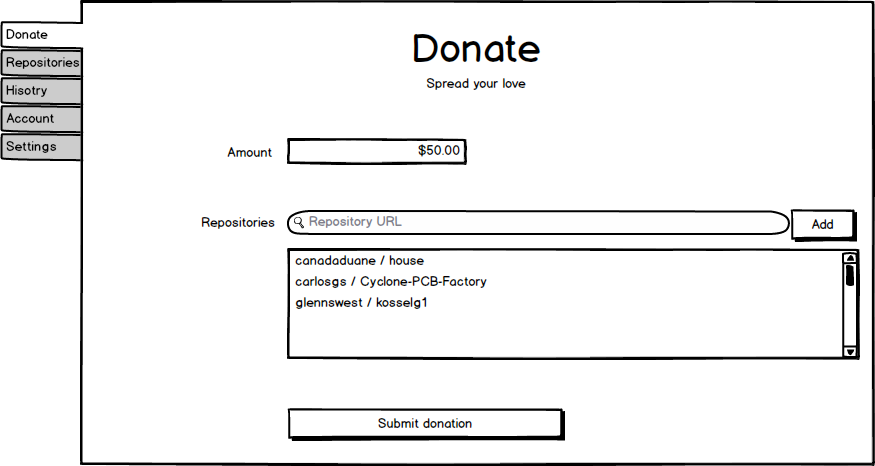
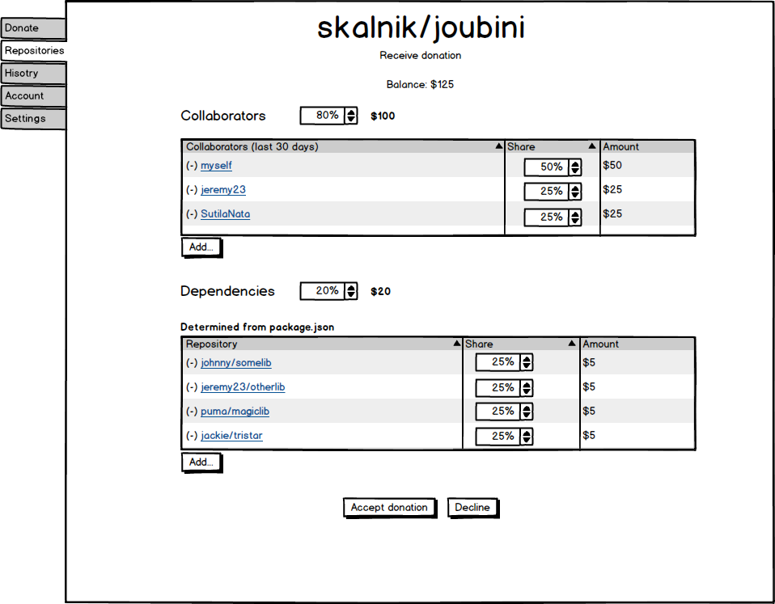

#BoomHub
*Boom - a loud, deep, resonant sound. Reverberation, resonance, resounding.*

#Motivation and purpose

Solve the problem of funding of free software, by building a system which allows developers to receive donations from corporate or private donors as well as from the people who build on their work. 

The ultimate goal is to make it possible for developers to work full time on the projects that they share with the world, while earning proportionally to how the community adopts their work.

#Concept

BoomHub is a service which allows people to donate money to open source projects on repository hosting services, such as GitHub or BitBucket.

It also allows (but does not require) project owners to distribute the funds that they receive between project collaborators and the dependencies used in the project.

'Dependencies' are defined as '*projects which make my project possible*' and can be libraries, asset files, development tools, editors, runtime environments, compilers...

As a consequence, the donations are recursive, where each project which receives a donation can share a slice of the funds with other projects on which it depends.

For many projects it is possible to determine the dependencies automatically by parsing the configuration files from the repository's source tree, but the project owners can add or remove dependencies which will receive donations as they see fit.

BoomHub is based on sharing out of gratitude and appreciation and hence, the way the funds are distributed is left entirely up to the project owner. 

#How it works

*I'm going to use the term 'Github' throughout this text to identify a 'repository hosting service', but BoomHub should work with most (all)
hosting services, such as BitBucket, SourceForge as long as said services provide a suitable integration API.*

*I use the terms 'project' and 'repository' interchangeably (although technically this is not always the case). Whenever the term 'project' is used, it is meant to be a public repository with a unique URL on an external service such as Github.*

*In general when I talk about a repository, it is meant that the repository is publicly available, regardless of the license used to distribute the source code.*

###Repository accounts
Every github repository and every github user has an associated BoomHub account (created automatically).

Developers log in using their github credentials, via Github API, so no registration is necessary.

After authorizing, developers gain access to the BoomHub accounts of their public github repositories (of which they are 'owners') and can redistribute or withdraw the funds as described further in this text.

###Who can donate

Anyone can donate funds to any repository on github. That means companies or people.

Project owners don't need to create an account with BoomHub in order to receive donations.
In this respect, BoomHum is 'opt-in' by default, but it will provide a simple way to [decline or disable](#declining) donations if project owners don't want to (or cannot) participate.

###Donating
Donors use the embedded search tool or paste the repository URLs to which they wish to make a donation.

Developers can also add the BoomHub URL to the README of their projects or even in the built applications, so that users can click the link directly.

They use their credit card, paypal or bitcoin to transfer the funds to BoomHub.

Donors can set up monthly donations for the projects they want to support and the system will perform the donations automatically every month.

#

###Accepting donations

When a project account balance reaches a certain threshold (eg. $20), the project's owner is notified via a Github message.

He then uses his github credentials to log into BoomHub, sees the repository's account balance and accepts (or declines) the donations.

When accepting the donation, the owner is provided with a user interface which allows him to choose how much of the donation will go to project collaborators (including the owner himself) and how much will go to the depenendencies (libraries, frameworks, editors, etc).

For example, the project owner might want 80% to go to project collaborators and 20% to the dependencies. 

The list of collaborators is determined automatically (through the Github API) and the owner can add or remove collaborators and tweak the percentage received by each of them (including himself), based on his subjective estimation of the contribution that they brought to the project.

For dependencies, the owner can add or remove dependencies and adjust the percentages which he chooses to forward.

For many projects, project dependencies can be determined [automatically](#dependencies).

When clicking 'Accept donation', the funds are transfered from the repository account to each collaborator (person) and dependency (repository) account.

Note that no money actually moves, the changes happen inside the BoomHub database; to receive the actual funds the people will have to [withdraw](#withdraw) them.

#
###Declining donations

For various reasons (tax, licensing, philosophy, etc), a project owner can decline a donation or can disable donations for one or all projects they are authoring. If this happens, the funds will be returned to the donor and dependendant projects will not be able to donate to repositories with disabled donations. This will happen recursively until the funds reach the original donor and his account will be credited with the declined amount. The donor can then donate to other projects or withdraw his funds back.

#
###Dependency detection

For many projects, dependencies can be determined automatically, by parsing the project package files, like package.json, Podfile, bower.json, gemfile, pip, ppm, CocoaPods, maven, leiningen, etc.
There are lots of package managers out there and BoomHub should support all of them eventually.

If the project does not have a 'package' file, some dependencies can be infered from things like git externals, makefiles or even parsing the sources to determine included files (eg. html scripts or css files).

Forked repositories will consider the parent repository as a dependency too.

BoomHub suggests dependencies which might be appropriate to donate to, however, the project owner is the one who makes the final decision, because the 'importance' of dependencies is subjective and specific to every project.

###Transparrency and privacy

**The issue of transparrency versus privacy is still very much open. There are arguments which can be made for total tranparrence or for total privacy. Currently, I'm assuming a totally transparrent service, which makes all donations public**

There are two possibilities:

- All donations are public. 

Everyone can see the amounts received by a repository, how much was distributed
to the team and how much has been distributed to dependencies.

The public will be able to browse the dependencies and see the donations and how the funds have been distributed between teams and dependencies.

- Donations are private or team-private

Financial details are totally hidden or only visible to some members of the team. 
There are many tricky issues with making donations secret and it might be hard to guarantee that without leaking information.
This might lead to tensions between projects or team members.

###Recognition
Various tokens of recognition can be offered for donors. This can include 'thank you' e-mail messages from every repository that has been directly or indirectly funded by his donation, and, depending on the amount donated, can even receive physical tokens of recognition in the form of letters or certificates from the BoomHub foundation. Project owners will be encouraged to include the donor's name in the application or in one of the source files (if it's a library).

Apart from that, donors can share the URL with the donation info on social media and receive recognition from their followers. 

#
###Withdrawing

Developers can only withdraw money from their personal BoomHub accounts. Balances in the accounts of repositories cannot be withdrawn directly, the owner first has to [accept](#accepting) the funds.
Money can be withdrawn using bitcoin, check or bank transfer. The developer must set up these details before withdrawing.

Alternatively, if the person doesn't need the funds, BoomHub could offer a list of charities or non profit organizations which the developer can donate to, thus contributing to other areas of society.

###Project owners

From BoomHub's perspective, the project owner is the Github user who owns the repository and authenticates using those credentials.

It is considered that whoever has access to the project owner's account, has or can obtain the authority to redistribute the funds received by the project.

'Project founder' is the person or entity who first commited the repository. Usually this is the project owner, but projects might be transfered, because people grow old, get sick or retire and are unable to maintain the project.

The owners who inherited a project should consider sharing a part of the donations with the project founders - this will serve as a free software version of a 'pension' and the BoomHub user interface should make this option available.

##BoomHub Foundation

###A world based on gratitude

BoomHub's mission is to introduce a new funding model to the world, a model based on gratitude, respect and generosity between people. 
The 'inverted pyramid' scheme makes it possible for people who bring the greatest contribution to receive funds from multiple sources, thus 
earning based on their merit as perceived by people using the fruits of their work. It allows creators to focus on what they do best (programming, writing, design) and not have to engage in marketing or promotion of their work or seek employment, although it doesn't exclude that either.

It also encourages developers to build more modular and reusable code - the more projects use your libraries as dependencies, the greater the probability of receiving donations.

###Legal entity

BoomHub must be a service in the interest of the greater public and not seek to profit from imposing fees on people's gratitude.

As such, BoomHub should not be incorporated as a commercial entity seeking profit, but as a non-profit organization, such as a foundation.

The foundation's purpose will be to develop and maintain the platform, accept payments and provide the service of withdrawing funds as well as legal and tax documents required by both donors and receipients.

It will also seek to promote the concept of the crowd funded economy - encourage people and organizations to donate to free software projects.

###Credibility

The main issue with creating a financial service like BoomHub is credibility. Developers and donors must trust the foundation's true intentions and that their funds will not be embezzeled or misrepresented. 

One of the methods of increasing the credibility would be to openly invite corporations and other foundations to participate as co-founders and co-chairs in the BoomHub foundation, so that no one party has full control and the philosophical underpinnings are not altered in a way which changes the core motivation of developers.

###Fees

Donations will probably be subjected to fees from services facilitating payments and fees for withdrawing funds, which are out of BoomHub's control.

BoomHub will not charge any fee for internal transfers of funds (between repositories and collaborators).

If it will be necessary to support BoomHub's operating expenses, developers will be kindly asked to donate to BoomHub when withdrawing the funds, however, alternate methods of funding will be sought, such as financial and technical support from corporate users of free software.

###Tax issues

Donations are taxable in many countries and BoomHub should address this issue with highest priority, otherwise many developers will not be able to participate.

This includes making sure that creators (and donors?) are provided with proper tax forms, receipts or documents which they can use when submitting their tax declarations.

To handle all the legal and tax implications on a global scale, BoomHub should employ experts in fields such as law and accounting.

My knowledge on this subject is limited, but I believe this can be accomplished.

#Implementing BoomHub

Currently, BoomHub is at the idea stage. This document’s purpose is to bring this idea to the world, receive feedback and involve ‘believers’ in the development of a prototype,  setting up the foundation, receiving support, etc.

For an overview of what help is needed and how you can contribute, please see [CONTRIBUTING.md](CONTRIBUTING.md)

